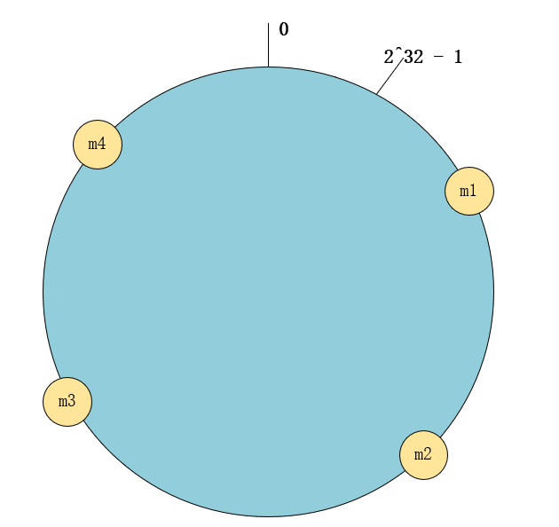
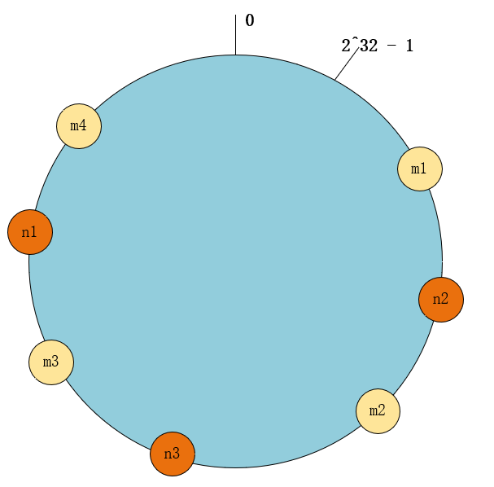
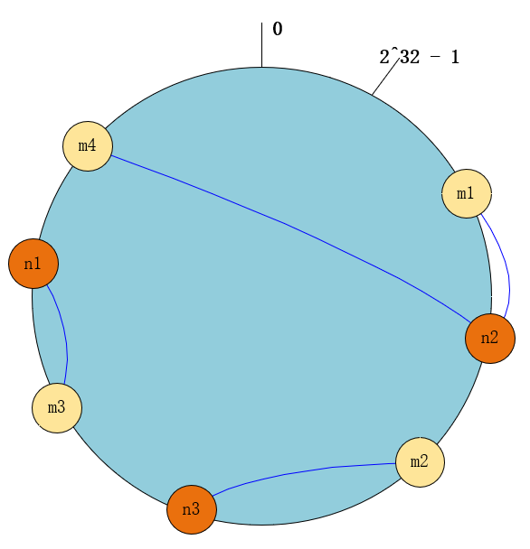
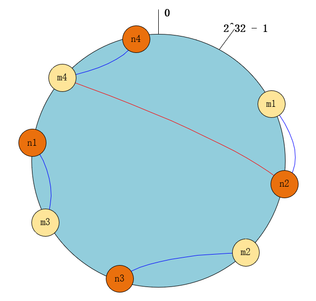

# 一致性哈希算法

在分布式存储中，可以使用哈希函数建立一个对象->机器的映射关系。

但是这样会存在一个问题，即负载均衡的拓展性不高。

举个例子，现在有 3 台机器，通过哈希算法，将 10 个数据 1...9 分别通过 hash(val) mod 3 分给三台机器。此时：

- 机器 0，数据：3，6，9
- 机器 1，数据：1，4，7
- 机器 2，数据：2，5，8

那么此时如果我们又充钱买了一台机器，即计算的方式变成 hash(val) mod 4。那么就会发生数据的迁移。如果，数据过多的话，就会消耗大量的资源进行迁移。这就是为什么说这种方式的负载均衡拓展性不高。

为了解决这个问题的一致性哈希算法就是今天的主题。

<!--truncate-->

## 介绍

一致性哈希算法是为了解决这类问题的方法，它可以保证当机器增加或者减少时，节点之间的数据迁移只限于两个节点之间。不会造成全局的网络问题。

### 算法原理

1. 环形 hash 空间

   按照常用的哈希算法，将对应的 key 哈希到一个个桶中。将这些桶首尾相连（一般是 2^32 个桶），形成一个闭合的环状空间，如下图：

   

2. 将数据通过 hash 算法映射到环上

   像前面说的，假设现在有 4 个数据，分别映射到 4 个桶（m1, m2, m3, m4），如下图：

   

3. 机器节点通过 hash 算法映射到环上

   假设有 3 台机器（n1, n2, n3），此时通过哈希算法，也映射到环上的桶中，如下图：

   

4. 将数据存储在机器中

   数据沿环顺时针，存储到离其最近的机器上。如下图：

   

5. 增加一个机器节点或者删除

   当增加一个节点时，比如 n4，此时数据的迁移只会在 n2 与 n4 之间发生，如下图：

   

   删除同理。

### 节点查找

如何去找到这些节点或者数据呢？

#### Napster

使用一个中心服务器接收所有的查询，中心服务器返回数据存储的节点位置信息。

**问题**：中心节点失效，整个网络瘫痪

#### Gnutella

使用消息洪泛定位数据。即一个消息被发送到系统内的每个节点，直到找到需要的数据为止。并使用生存时间来限制网络内转发消息的数量。

**问题**：消息数与节点是线性关系，网络负载较重

#### SN 型

即 super node，保存网络中节点的索引信息（和中心服务器一样）。但是会有多个 SN，并且索引信息会在这些 SN 中传播。

### hash 环的倾斜（即负载不均衡

以这张图为例

假如后续加入了非常多的节点，全在 n3 和 n2 之间，导致 n3 的数据量激增，而其他机器的数据量相当于没有。这就又回到了开始的那个问题。

在极端状况下，此时 n3 出现故障，n3 的数据需要迁移到 n1，大量的数据将 n1 打崩，然后把整个环上的机器打崩。这种情况称为雪崩效应。

**解决方法**

有问题的出现，一般就有解决方法。

我们可以使用虚拟节点。

现实情况中，机器的数量是固定的，我们可以将现有的物理节点通过虚拟的方法复制多个出来。加入虚拟节点后，n3 和 n2 的中间可能会存在 n1， n2，这样就会尽可能的将是负载均衡。

## 实现

可以看看这篇文章 [一文讲透一致性哈希的原理和实现 - 知乎 (zhihu.com)](https://zhuanlan.zhihu.com/p/439268771)

总结一下细节就是：

- 环上全设虚拟节点，然后建立映射关系
- 使用 map 来存储物理节点，用来快速判断是否有该节点
- 使用数组或切片存储虚拟节点，使用哈希表存储虚拟节点到物理节点的映射。

## Reference

[一致性哈希算法（consistent hashing） - 知乎 (zhihu.com)](https://zhuanlan.zhihu.com/p/129049724)

[聊聊一致性哈希算法，什么是一致性哈希算法，图解面试热点问题，还看不懂你来打我 - 知乎 (zhihu.com)](https://zhuanlan.zhihu.com/p/166126098)

