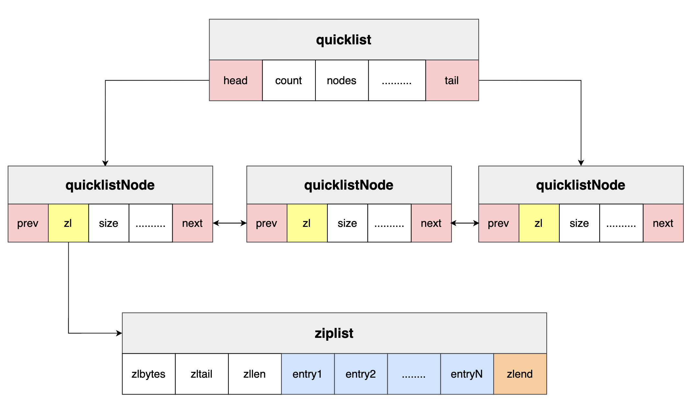

# Redis 概念整理

## 前言

题目部分来自 [题库｜编程满天星 (itmtx.cn)](https://itmtx.cn/question)，本文为归纳整理，方便记忆。

**持续更新中……**

| 更新内容                                                  | 更新时间  |
| --------------------------------------------------------- | --------- |
| 更新 Redis 五大基本数据类型。                             | 2023.8.20 |
| 更新 Redis 六大底层数据结构部分内容。                     | 2023.8.31 |
| 更新 Redis 常见的三大问题：缓存雪崩、缓存穿透以及缓存击穿 | 2023.9.24 |

<!--truncate-->

## Redis 有什么用？为什么用 Redis？

**1. 结合自身项目**

在做的各种登录流程中，通常会用 redis 存储 token 或者 refresh_token。目的大多是为了减轻 mysql 的负担。

在做一个秒杀系统时，可以使用 redis 来防止太多请求打入 mysql。也可以使用 redis 来控制商品数量，比如使用 list，分布式锁，setnx 等控制。

**2. 加入缓存后的数据处理流程**


1. 如果用户请求的数据在缓存中就直接返回数据
2. 缓存未命中的话就看数据库中是否存在
3. 数据库中存在的话就返回数据并将该数据写入到缓存中
4. 数据库中也不存在的话就返回空数据

**3. 得到的收益以及付出的成本**

**收益**（使用缓存的好处）：

- 加速读写：缓存通常都是全内存的（例如 Redis、Memcache），而存储层通常读写性能不够强悍（例如 MySQL），通过缓存的使用可以有效地加速读写，优化用户体验
- 降低后端负载：帮助后端减少访问量和复杂计算（例如很复杂的SQL语句），在很大程度降低了后端的负载

**成本**：

- 数据不一致性
- 代码维护成本
- 运维成本


## Redis 的五大基本数据类型

### 1. 字符串 String

string 是 Redis 最基本的类型，存储方式为 key-value。

string 类型是二进制安全的，换句话说，它可以包含任何数据。比如图片和序列化后的对象。

string 类型的值最大能存储 512MB。

### 2. 哈希 Hash

hash 是一个键值对（key=>value）集合。

hash 是一个 string 类型的 field 和 value 的映射表，hash 特别适合用于存储对象。

key 为 哈希表的名称，field 为哈希表的 key，value 为哈希表的 value。

### 3. 列表 List

list 是一个简单的字符串列表，按照插入顺序排序。相当于一个双端队列（链表），可以左右插入以及左右弹出。

### 4. 无序集合 Set

set 是通过哈希表实现的，所以添加、删除和查找的时间复杂度都为 $$O(1)$$

sadd 用于添加一个 string 元素到 key 对应的 set 集合中，成功返回 1，已存在元素返回 0。如果没有对应 key 的 set 集合则返回错误。

### 5. 有序集合 ZSet

zset 与 set 差不多，区别在于它有一个分数（score），通过这个分数可以进行排序。元素不可一致，但是分数可以。


## Redis 的六大底层数据结构

### 1. 整数集合 intset

**inset 的定义**

```c
typedef struct intset{
	// 编码方式
	uint32_t encoding;
	// 集合包含的元素数量
	uint32_t length;
	// 保存元素的数组
	int8_t contents[];
} intset;
```

`contents[]`: 各个项在 content 数组中按值的大小从小到大有序排列，并且数组中不包含**任何重复项**。


`encoding`：encoding 表示 contents 数组的编码方式（这个属性和升级操作息息相关）

- INTEST_ENC_INT16
- INTSET_ENC_INT32
- INTSET_ENC_INT64


**升级 upgrade**

什么是升级？

每当我们要将一个新元素添加到整数集合里面，并且新元素的类型（encoding）


### 2. 简单动态字符串 SDS(simple dynamic string)

Redis 没使用传统的 C 语言字符串表示，而是构建了一种名为简单动态字符串的抽象类型。下图是它的定义：


- `int len`：buf 中已使用空间的长度
- `int free`：**buf 中剩余可用空间的长度**（这个字段可以说是 SDS 的灵魂所在）
- `char buf[]`：数据空间（SDS 遵循 C 字符串以空字符结尾的惯例）


**为什么要用 SDS**

1. **O(1) 时间复杂度获取字符串长度**：获取一个 C 字符串的长度的时间复杂度是 O(N)，因为 SDS 在 len 属性中记录了 SDS 本身的长度，所以获取时间复杂度为 O(1)。

2. **杜绝缓冲区溢出**：因为 C 字符串本身它不记录自身长度，当分配的内存不能够支撑字符串的所有内容时，就可能会产生缓冲区溢出。而 SDS 的 **空间预分配** 策略，杜绝了发生缓冲区溢出的可能性。

3. **减少修改字符串带来的内存重分配次数**：C 字符串不记录自身长度，所以当增长或缩短一个 C 字符串时，程序总要对保存这个字符串的数组进行一次内存重分配操作。像上面说的，这会产生两个问题：

   - **内存泄漏**：如果程序执行的是缩短字符串的操作，比如 trim，那么在执行这个操作之后，程序需要通过内存重分配来释放字符串不再使用的那部分空间。如果忘记了这一步就会产生内存泄漏。
   - **缓冲区溢出**：如果程序进行的是增长字符串的操作，比如 append，那么在执行这个操作之后，程序需要先进行内存重分配来拓展底层数组的空间大小。如果忘记了这一步就会产生缓冲区溢出。

   上边说过，free 是 SDS 的灵魂，通过 free 解除了字符串长度和底层数组长度之间的关联：

   - **空间预分配：**用于优化 SDS 的字符串增长操作，防止缓冲区溢出，并减少字符串增长时的空间重分配的次数。当需要对一个 SDS 进行空间拓展时，不仅分配修改所需要的空间，并额外分配未使用的空间 free。如果 SDS 的长度小于 1MB，那么分配的 free 与 SDS 的长度相等（也就是 `SDS.len = free`）。如果大于 1MB，那么 free 的长度为 1MB.
   - **惰性空间释放：**防止内存泄漏，用于优化 SDS 字符缩短操作，减少字符串缩短时的空间重分配次数。当缩短 SDS 字符串时，free 会将回收后多出来的字节数量记录起来，等待将来使用。

4. **二进制安全**：所有的 SDS API 都会以处理二进制的方式来处理 SDS 存放在 buf 数组里的数据，程序不会对其中的数据做任何限制、过滤或者假设，数据在写入时是什么样的，读取时就是什么样的。

5. **兼容部分 C 字符串函数**：SDS 遵循 C 字符串以空字符结尾的惯例，使得其可以重用一部分 C 语言中 `<string.h>` 库定义的函数，避免不必要的代码重复


### 3. 字典 dict

底层：数组 + 链表


### 4. 链表（双端链表） list

我也感觉这个应该没啥好说的，就双端链表。


### 5. 压缩列表 ziplist

**压缩列表与数组的区别**：

- 数据要求每个元素的大小相同，而压缩列表中的每个元素可以占用不同大小的空间。
- 压缩列表给每个节点添加了 `previous_entry_length` 的属性，用来表示前一个节点的长度。


- **zlbytes**：记录整个压缩列表占用的内存字节数。
- **zltail**：记录压缩列表尾节点与起始节点有多少个字节。通过这个偏移量，程序无需遍历整个压缩列表就可以确定表尾节点的地址。
- **zllen**：压缩列表包含的节点数量。
- **entry**：压缩列表包含的各个节点，节点长度由保存内容决定。


每个压缩列表节点都由 previous_entry_length、encoding、content 三部分组成：

- **previous_entry_length**：记录压缩链表前一个节点的长度。
- **encoding**：记录 content 属性所保存数据的类型及长度。
- **content**：保存节点的值。


**什么是 cascade update（连续更新）**

简单来说，就是当添加或删除一个节点时，原有节点的 previous_entry_length 需要更新，因为内存空间的变化，导致它的后一个节点也需要更改这个属性，然后后一个节点的后一个节点又需要变化，这样持续到将所有节点改完。

尽管这个连续更新的时间复杂度为 O(n) ，但是它一般不会影响压缩列表的性能。因为需要恰好有多个连续且长度介于那个临界点之间的节点，连续更新才有可能被引发。


**Redis 3.2 引入的 quicklist**

3.2 之前 List 对象的底层实现是 ziplist + list。



主要就是将大的 ziplist 拆分然后以链表的形式组织起来。


**Redis 5 引入的 listpack**


- **少了一个 zltail_offset 字段**。这个字段是 ziplist 用来定位最后一个元素的位置，用于逆序遍历的，不过 listpack 可以根据 listpack 头中记录的 total_bytes 总长度直接定位到 listapck 的尾部结束标记，然后根据每个 entry 的长度逐个往前遍历
- **每个列表项都只记录自己的长度**，不会像 ziplist 的列表项会记录前一项的长度。所以在 listpack 中新增或修改元素，只会涉及到列表项自身的操作，不会影响后续列表项的长度变化，进而避免连锁更新


### 6. 跳跃表 skiplist


## Redis 三大问题及其解决方案（规划中）

### 1. 缓存雪崩

当某一个时刻出现大规模的缓存失效的情况，那么就会导致大量的请求直接打在数据库上面，数据库的压力突增，在高并发的情况下，可能会导致数据库宕机。这时候如果重启数据库，马上又有新的流量把数据库打死。这就叫 **缓存雪崩**。

**可能原因**：

造成缓存雪崩的关键在于同一时间大规模的 key 失效，原因可能是：

- Redis 宕机。
- 采用了相同的过期时间。

**解决方案**：

- **在原有的失效时间上加上一个随机值**。比如为同一过期时间的 key 随机加上 1-5 分钟。这样就可以避免同一时间过期导致的缓存雪崩。
- **使用熔断机制**。当流量达到一定的阈值时，直接返回 **服务器繁忙** 等提示。保证一部分用户可以正常使用。
- **搭建 Redis 集群**。提高 Redis 的容灾能力。
- **提高数据库容灾能力**。分库分表，读写分离。


### 2. 缓存击穿

缓存雪崩是大规模的 key 失效，而缓存击穿是一个热点的 key，突然失效了。然后大量的并发请求同时打在数据库上，导致数据库压力激增，这就是 **缓存击穿**。

**可能原因**

- **热 key 过期**。过期导致 key 失效，从而打到数据库上。

**解决方案**

- **热 key 设置永不过期**。如果业务允许，可以将热 key 设置为永不过期。
- **使用互斥锁**。如果缓存失效，只有拿到锁才可以查询数据库，降低数据库上的请求数，防止被打死。但是这种解决方案会导致系统性能变差。


### 3. 缓存穿透

我们在使用 Redis 时，大部分是通过 key 去查询对应的值。Redis 都是弱依赖，当我们在 Redis 中找不到对应的数据时，我们会访问数据库查询。假如短时间内或者同一时间有大量这样的请求，那么它会像穿透了缓存一样打在数据库上，导致数据库宕机或者出现其他问题。这种现象就叫做 **缓存穿透**。

**可能原因**

- 最主要的原因就是这个 key 不存在。
- 在业务中，比如秒杀活动，也可能是活动开始前当前的 key 未写入 Redis，但却被别人发现了。

**解决方案**

- **将无效的 key 存入 Redis 中**。如果 Redis 查不到数据库也查不到，将其写入至 Redis 并存为空或者一个特殊值。那么下次查询就不需要再打进数据库了。
- **提前存储热 key**。我们可以将热 key 提前存储在 Redis 中，并在开始使用前设置成一个特殊值。
- **使用布隆过滤器**。布隆过滤器最大的作用就是：一个值它说不存在，那么就一定不存在。它说存在，大概率是存在的（有误判率）。所以我们可以去布隆过滤器查询 key 是否存在，不存在直接返回。
