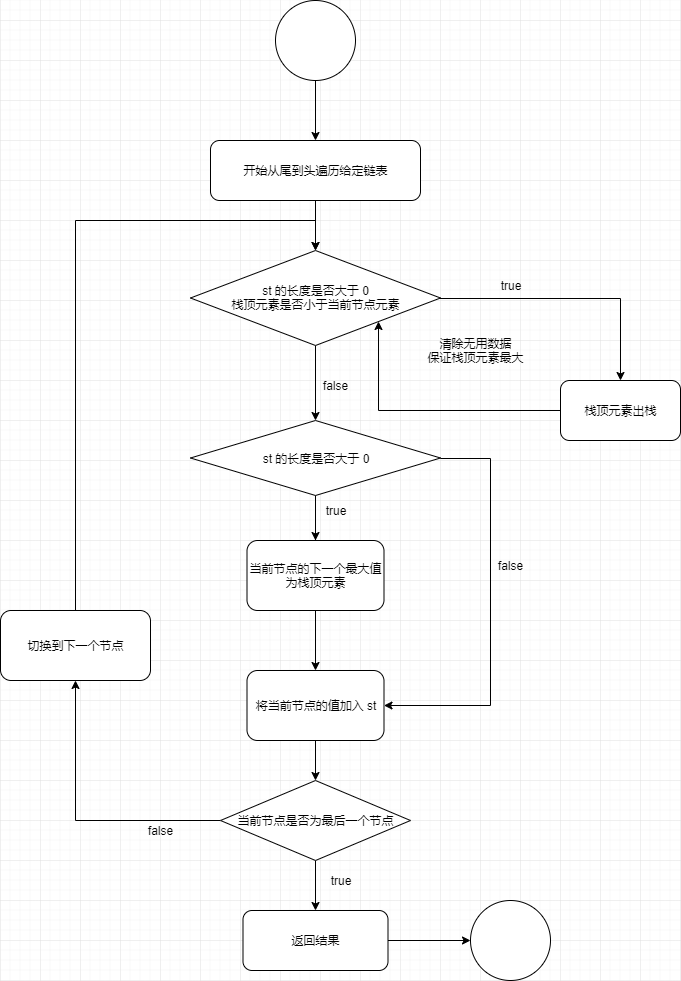
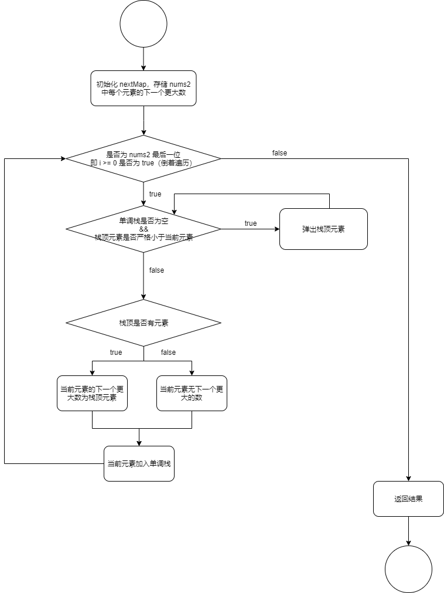

# 单调栈

## 题目

[1019. 链表中的下一个更大节点 - 力扣（LeetCode）](https://leetcode.cn/problems/next-greater-node-in-linked-list/description/)

[496. 下一个更大元素 I - 力扣（LeetCode）](https://leetcode.cn/problems/next-greater-element-i/description/)

[503. 下一个更大元素 II - 力扣（LeetCode）](https://leetcode.cn/problems/next-greater-element-ii/description/)

[2454. 下一个更大元素 IV - 力扣（LeetCode）](https://leetcode.cn/problems/next-greater-element-iv/)

[456. 132 模式 - 力扣（LeetCode）](https://leetcode.cn/problems/132-pattern/description/)

[739. 每日温度 - 力扣（LeetCode）](https://leetcode.cn/problems/daily-temperatures/description/)

[901. 股票价格跨度 - 力扣（LeetCode）](https://leetcode.cn/problems/online-stock-span/)

[1124. 表现良好的最长时间段 - 力扣（LeetCode）](https://leetcode.cn/problems/longest-well-performing-interval/description/)

[1475. 商品折扣后的最终价格 - 力扣（LeetCode）](https://leetcode.cn/problems/final-prices-with-a-special-discount-in-a-shop/description/)

<!--truncate-->

## LeetCode 1019

### 思路流程图

从链表尾部开始向头部遍历（递归或者反转链表都可以）



### 实现代码

```go
func nextLargerNodes(head *ListNode) (res []int) {
    var st = []int{} // 单调栈
    var f func(*ListNode, int)
    f = func(node *ListNode, i int){
        if node == nil{
            res = make([]int, i) // i 为链表长度
            return
        }
        f(node.Next, i+1) // 开始递归
        // 此时到最后一个节点，开始从右到左遍历
        for len(st) > 0 && st[len(st) - 1] <= node.Val{
            // 如果栈内不为空，现在的值比栈顶的大，弹出无用数据
            st = st[:len(st) - 1]
        }
        if len(st) > 0{
            // 栈顶就是 res[i] 的下一个最大元素
            res[i] = st[len(st) - 1]
        }
        st = append(st, node.Val)
    }
    f(head, 0)
    return
}
```


## LeetCode 496

### 思路流程图

和上一个差不多，多了个 map



### 实现代码

```go
func nextGreaterElement(nums1 []int, nums2 []int) []int {
    var res = make([]int, len(nums1))
    var nextMap = make(map[int]int) // 记录 nums2 每个元素的下一个大元素
    var st = []int{} // 初始化单调栈
    for i := len(nums2) - 1; i >= 0; i--{
        for len(st) > 0 && st[len(st) - 1] < nums2[i]{
            // 如果栈顶元素比现在的小，弹出
            // 因为它不可能是左边的元素的下一个比它大的元素了
            st = st[:len(st) - 1]
        }
        if len(st) > 0{
            // 如果栈内有元素，下一个元素就是它的最大元素
            nextMap[nums2[i]] = st[len(st) - 1]
        }else{
            nextMap[nums2[i]] = -1
        }

        st = append(st, nums2[i])
    }

    for i := range nums1{
        res[i] = nextMap[nums1[i]]
    }

    return res
}
```


## LeetCode 503

### 思路

是一个循环的数组，只需要两遍单调栈操作就行。

流程图略。

### 实现代码

```go
func nextGreaterElements(nums []int) []int {
    var acLen = len(nums)
    var res = make([]int, acLen)
    nums = append(nums, nums...)
    var st = []int{} // 初始化单调栈
    for i := len(nums) - 1; i >= 0; i--{
        var nowIndex = i % acLen
        for len(st) > 0 && st[len(st) - 1] <= nums[nowIndex]{
             st = st[:len(st) - 1]
        }
        if len(st) > 0{
            res[nowIndex] = st[len(st) - 1]
        }else{
            res[nowIndex] = -1
        }
        st = append(st, nums[nowIndex])
    }
    return res
}
```


## LeetCode 2454

### 思路

本题用到了两个单调栈，其中与上述代码思路不一样的是

```go
var j = len(s) - 1
for j >= 0 && nums[s[j]] < num {
    j--
}

t = append(t, s[j+1:]...)
s = append(s[:j+1], i)
```

**j 在 t 中的用处**

我们将 s 中弹出的元素压入 t 中，需要保**证压入栈时是原有的顺序**。为什么呢，因为 s 是一个单调递减栈，我们在循环一个个出栈时，将栈顶元素一个个压入到 t 中时，t 就变成了一个单调递增栈。这样 s 和 t 的单调性不一样，在进入下一轮遍历时，没有办法顾虑到更小的元素。

举个例子：

```text
nums = [11,13,15,12,0,15,12,11,9]
```

当 i = 5 时（也就是第二个 15），我们会先将下标为 1（也就是元素 13）出栈，然后将压入 0，后压入 12。此时 t 栈的结构为：

```text
|		|
|	12	|
|	0	|
```

在下一轮遍历中（i = 6），12 与栈顶元素 12 比较，发现不满足条件，t 也就不弹栈，导致栈底元素 0 无法与 12 比较，也就找不到下一个更大元素。

当然，在实现中存的是下标，上述只是为了方便理解。

**j 在 s 中的用处**

for 循环统计了 s 中需要出栈的元素，`s = append(s[:j+1], i)` 等价于 

```go
s = s[:j+1]
s = append(s, i)
```

或者原有逻辑

```go
for len(s) > 0 && s[len(s) - 1] < num{
    s = s[:len(s) - 1]
}
s = append(s, i)
```


### 实现代码

```go
func secondGreaterElement(nums []int) []int {
    var s = []int{} // 遍历符合要求的第一个单调栈
    var t = []int{} // 第一个单调栈栈顶符合要求的第二个单调栈
    var res = make([]int, len(nums))
    for i, num := range nums{
        for len(t) > 0 && nums[t[len(t) - 1]] < num{
            // 栈顶找到了第二个比它大的
            res[t[len(t) - 1]] = num
            t = t[:len(t) - 1]
        }

        var j = len(s) - 1
        for j >= 0 && nums[s[j]] < num {
            j--
        }

        t = append(t, s[j+1:]...)
        s = append(s[:j+1], i)

        res[i] = -1
    }
    return res
}
```


## LeetCode 456

### 思路

这题主要多了一个中转数 temp。

要实现 1 3 2 的结构，可以维护一个单调栈（单调递减，底大顶小），在遍历时遇到比栈顶大的元素，出栈，并将出栈元素赋值给 temp。此时 2 和 3 都有了。在每一次遍历时，如果栈内有元素，temp 不为初始值，那么可以比较 temp 和当前元素的差别。如果 temp 大于当前元素（也就是 2 大于 1），那么 132 模式成立，直接返回 true。

这里有一点是，判断当前元素与 temp 的大小在每次出栈操作前边还是后边都不影响。

### 实现代码

```go
func find132pattern(nums []int) bool {
    var st = []int{} // 单调栈
    var temp int = -1000000001 // 中转数
    for i := len(nums) - 1; i >= 0; i--{
        for len(st) > 0 && st[len(st) - 1] < nums[i]{
            // 栈顶是 3，temp 是 2
            temp = st[len(st) - 1]
            st = st[:len(st) - 1]
        }

        if len(st) > 0 && nums[i] < temp{
            return true
        }

        st = append(st, nums[i])
    }
    return false
}
```


## LeetCode 739

### 思路

没啥好讲的，就单调栈。

### 实现代码

```go
func dailyTemperatures(temperatures []int) []int {
    var res = make([]int, len(temperatures))
    var st = []int{}
    for i := len(temperatures) - 1; i >= 0; i--{
        for len(st) > 0 && temperatures[st[len(st) - 1]] <= temperatures[i]{
            st = st[:len(st) - 1]
        }
        if len(st) > 0{
            res[i] = st[len(st) - 1] - i
        }
        st = append(st, i)
    }
    return res
}
```


## LeetCode 901

### 思路

这道题和之前不一样的点在于，这个距离。如果单调栈内无元素，证明当前元素比之前的所有元素都大（没有元素那它也是最大的），那么只需要返回它的 idx 即可。如果有元素，那就是它左边比它大的第一个元素，idx 相减即可。

### 实现代码

```go
type StockSpanner struct {
    idx int // 记录这是第几个
    data [][2]int // 单调栈
}


func Constructor() StockSpanner {
    return StockSpanner{}
}


func (this *StockSpanner) Next(price int) int {
    this.idx++
    for len(this.data) > 0 && this.data[len(this.data) - 1][1] <= price{
        this.data = this.data[:len(this.data) - 1]
    }
    var res int
    if len(this.data) > 0 {
        res = this.idx - this.data[len(this.data) - 1][0]
    }else{
        res = this.idx
    }

    this.data = append(this.data, [2]int{this.idx, price})
    return res
}
```


## LeetCode 1124

### 思路

这题和之前不一样的是，用到了前缀和数组。以及求的是 **[最长]**

我的理解是：

1. 先构造一个前缀和数组，数组中的元素是在这之前 **「劳累的天数」**与**「不劳累的天数」**的**差**。也就是 s[i] = 下标 [0, i) 中劳累的天数与不劳累天数的差。

2. 创建这个前缀和数组时（遍历 hours），维护一个单调递减的单调栈，单调栈在初始化时有一个元素 0（下标）。**单调栈内存储的是最长子数组的左端点**。
3. 在计算了当前元素的前缀和后，比较当前前缀和与栈顶元素的大小。如果当前前缀和小于栈顶元素下标表示的前缀和，就将前缀和入栈。为什么呢？如上边说的，**单调栈内存储的是最长子数组的左端点**。

### 代码实现

```go
func longestWPI(hours []int) int {
    var res int
    var s = make([]int, len(hours) + 1) // 前缀和数组
    var st = []int{0}
    for j, hour := range hours{
        j++
        s[j] = s[j - 1]
        if hour > 8{
            s[j]++
        }else{
            s[j]--
        }

        if len(st) > 0 && s[j] < s[st[len(st) - 1]]{
            st = append(st, j)
        }
    }

    for i := len(hours); i > 0; i--{
        for len(st) > 0 && s[i] > s[st[len(st) - 1]]{
            res = max(res, i - st[len(st) - 1])
            st = st[:len(st) - 1]
        }
    }
    return res
}

func max(x,y int) int{
    if x > y{
        return x
    }
    return y
}
```


## LeetCode 1475

### 思路

没啥好说的，单调递增栈

### 实现代码

```go
func finalPrices(prices []int) []int {
    var res = make([]int, len(prices))
    var st = []int{}
    for i := len(prices) - 1; i >= 0; i--{
        for len(st) > 0 && st[len(st) - 1] > prices[i]{
            st = st[:len(st) - 1]
        }

        if len(st) > 0{
            res[i] = prices[i] - st[len(st) - 1]
        }else{
            res[i] = prices[i]
        }

        st = append(st, prices[i])
    }
    return res
}
```


## Reference & Thanks

[灵神的单调栈题单](https://github.com/EndlessCheng/codeforces-go/blob/master/copypasta/monotone_stack.go)

[496. 下一个更大元素 I - 力扣官方题解](https://leetcode.cn/problems/next-greater-element-i/solutions/1065517/xia-yi-ge-geng-da-yuan-su-i-by-leetcode-bfcoj/)

[2454. 下一个更大元素 IV - 灵茶山艾府的题解](https://leetcode.cn/problems/next-greater-element-iv/solutions/1935877/by-endlesscheng-q6t5/)

[456. 132 模式 - 宫水三叶的题解](https://leetcode.cn/problems/132-pattern/solutions/676970/xiang-xin-ke-xue-xi-lie-xiang-jie-wei-he-95gt/)

[901. 股票价格跨度 - 力扣官方题解](https://leetcode.cn/problems/online-stock-span/solutions/1906765/gu-piao-jie-ge-kua-du-by-leetcode-soluti-5cm7/)

[1124. 表现良好的最长时间段 - 灵茶山艾府的题解](https://leetcode.cn/problems/longest-well-performing-interval/solutions/2110211/liang-chong-zuo-fa-liang-zhang-tu-miao-d-hysl/)
