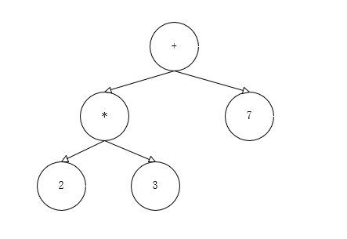

# 预备知识

## 准备工作

### 源代码调试

源码可以在[仓库](https://github.com/golang/go)找到。

我们可以修改源码，然后通过 Golang 官方提供的脚本 `make.bash`（在目录 `src` 下） 编译代码及工具链。

编译好后，二进制文件会存储在 `bin` 目录下。我们可以通过终端命令

```sh
$GOPATH/src/github.com/golang/bin/go run main.go
```

来运行程序，可得到修改源码后对应的结果。

这里不能使用

```sh
go run main.go
```

否则会使用包管理器，从而编译的是官方的包，得不到预期效果。

### 中间代码

我们可以通过下述命令，将编写的 Go 程序编译成汇编代码：

```go
go build -gcflags -S main.go
```


## 编译原理

### 编译过程

#### 预备知识

**抽象语法树**，Abstract Syntax Tree，AST。是源代码语法的结构的一种抽象表示，用树状的方式表示编程语言的语法结构。抽象语法树中的每个节点都表示源代码中的一个元素，每一棵子树都表示一个语法元素。

它是编译器常用的数据结构，抹去了源代码中不重要的字符—空格、分号或者括号等等。这个抽象语法树会辅助编译器进行语义分析，可以用它确定语法正确的程序是否存在一些类型不匹配的问题。

例如，表达式 `2 * 3 + 7`，编译器的语法分析阶段会生成如下图所示的抽象语法树：



**静态单赋值**

静态单赋值是中间代码的特性，如果中间代码具有这个特性，那么每个变量只会被赋值依次。在实践中，通常会用下标实现静态单赋值。比如：

```go
x := 1
x := 2
y := x
```

上述代码中，`x := 1` 没有任何作用。下面是有静态单赋值特性的中间代码：

```go
x_1 := 1
x_2 := 2
y_1 := x_2
```

我们可以发现变量 `y_1` 与 `x_1` 是没有关系的，所以在机器码生成时可以省去 `x := 1` 的赋值，从而优化需要执行的这段代码。

**指令集**

当开发环境编译运行的代码，在生产环境无法正常工作时，可能的原因之一是使用的指令集不同。

Macbook 可以使用命令

```sh
uname -m
```

Windows 可以使用命令

```sh
systeminfo
```


复杂指令集计算机（CISC）和精简指令集计算机（RISC）是两种遵循不同设计理念的指令集，两者的区别是：

- 复杂指令集，通过增加指令类型减少需要执行的指令数。
- 精简指令集，通过更少的指令类型完成目标的计算任务。


#### 编译原理

Go 语言编译器的源代码在 `src/cmd/compile` 目录中，目录下的文件共同组成了 Go 语言的编译器。编译器分为两部分：

- 前端，负责语法分析、词法分析、类型检查和中间代码生成
- 后端，负责目标代码的生成和优化，也就是将中间代码翻译成目标机器能够运行的二进制机器码。

而 Go 的编译器在逻辑上可以分成四个阶段：

1. 词法分析 + 语法分析
2. 类型检查 + AST 转换
3. 通用 SSA 生成
4. 机器代码生成


##### 词法分析与语法分析

词法分析的作用是解析源代码文件，将文件中的字符串序列转换成 Token 序列，方便后面的处理和解析，一般把执行词法分析的程序称为词法解析器。

词法分析的输入是词法分析器输出的 Token 序列，它会按照顺序解析 Token 序列，给过程会将词法分析生成的 Token 按照编程语言定义号的语法（Grammar）自上而下或者自下而上的规约，每一个 Go 的源代码文件最终会被归纳成一个 SourceFile 结构。

```go
SourceFile = PackageClause ";" { ImportDecl ";" } { TopLevelDecl ";" } .
```

词法分析会返回一个不包含空格、换行的字符的 Token 序列。

然后会进行语法分析，语法分析会把 Token 序列转换成有意义的结构体，即语法树：

```go
"json.go": SourceFile {
    PackageName: "json",
    ImportDecl: []Import{
        "io",
    },
    TopLevelDecl: ...
}
```

Token 到上述抽象语法树（AST）的转换过程会用到语法解析器，每一个 AST 都对应着一个单独的 GO 文件，内容通常包括当前文件属于的包名，定义的常量，结构体和函数。

语法解析的过程中发生的任何语法错误都会被语法解析器发现并将信息打印到标准输出上，整个编译过程也会随着错误的出现而被中止。


##### 类型检查

当拿到一组文件的抽象语法树后，Go 语言的编译器会对语法树中定义和使用的类型进行检查，类型检查会按照以下顺序分别验证和处理不同类型的节点：

1. 常量、类型和函数名及其类型
2. 变量的赋值和初始化
3. 函数和闭包的主体
4. 哈希键值对的类型
5. 导入函数体
6. 外部声明

通过对整棵树的遍历，在每个节点都会对当前子树的类型进行验证，保证节点不存在类型错误。所有的类型错误和不匹配都会在这个阶段被暴露出来（包括结构体对接口的实现）。

类型检查阶段不止会对节点的类型进行验证，还会展开和改写一些内建的函数（比如 make）。

##### 中间代码生成

当转换成抽象语法树，并对整棵树的语法进行解析且类型检查后，就可以认为当前文件不存在语法错误和类型错误。

然后，Go 语言的编译器就会将输入的抽象语法树转换成中间代码。

##### 机器码生成

在中间代码生成后，就需要转换成计算机可以执行的机器码。Go 语言可以通过不同的包生成机器码，这也是 GO 语言为什么能跨平台编译的原因。

