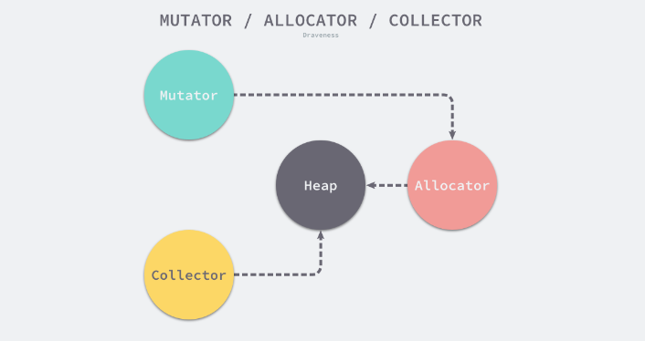
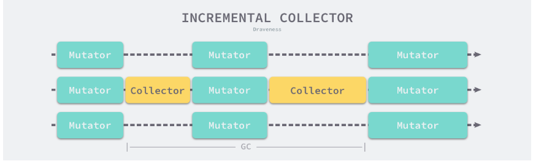
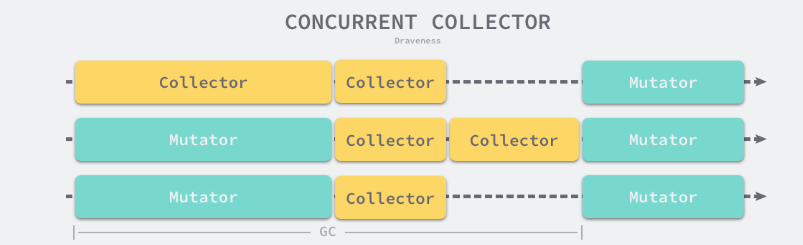

# Golang gc（垃圾收集器）

本节讲 Golang 垃圾收集器的原理。

## 设计原理



用户程序（Mutator）会通过内存分配器（Allocator）在堆上申请内存，而垃圾收集器（Collector）会负责回收堆上的内存空间。内存分配器和垃圾收集器共同管理这程序中的堆内存空间。

### 标记清除

标记清除算法是最常见的垃圾收集算法，标记清除收集器是跟踪式垃圾收集器，执行过程可分为标记和清除两个阶段：

- 标记阶段：从根对象出发查找并标记堆中所有存活的对象。具体来说，从根节点出发，所有可达的对象都会被标记。
- 清除阶段：遍历堆中的全部对象，回收未被标记的垃圾对象并将回收的内存加入空闲链表

这种算法有种弊端，就是在整个过程中，会进行 STW，也就是将用户程序停止。当长时间停止时，这种算法带来的损失是不可估计的。

### 三色标记

为了解决原始标记清除算法带来的长时间 STW，多数现代追踪式垃圾收集器会实现三色标记法的变种以缩短 STW 的时间。三色标记法将程序中的对象分成白黑灰三种类型。

- 白色，潜在的垃圾，内存可能会被垃圾收集器回收
- 黑色，活跃的对象，包括不存在任何引用外部指针的对象以及从根节点可达的对象
- 灰色，活跃的对象，因为存在指向白色对象的指针。垃圾收集器会扫描这些对象的子对象

在垃圾收集器开始工作时，程序中不存在任何黑色对象，垃圾收集的根对象会被标记成灰色。垃圾收集器只会从灰色对象集合中取出对象开始扫描。当灰色集合中不存在任何对象时，标记阶段就会结束。

这个算法的大致流程如下：

1. 从灰色对象集合中选择一个灰色对象，并将其标记成黑色
2. 将黑色对象指向的所有对象都标记成灰色，保证该对象和被该对象引用的对象都不会被回收
3. 重复上述两个步骤，直到对象图中不存在灰色对象

当三色标记的标记阶段结束后，应用程序的堆就不会存在任何灰色对象。我们只能看到黑色的存活对象和白色的垃圾对象。垃圾收集器会回收这些白色的垃圾。

同时，因为用户程序可能在标记执行的过程中修改这些对象的指针，所以三色标记算法本身时不可以并发或者增量执行的，它仍然需要 STW。而本来不应该被回收的对象却被回收了，这在内存管理中是非常严重的错误，这种错误被称为悬挂指针。即指针没有指向特定类型的合法对象，影响了内存的安全性。

如果想要并发或者增量的标记对象，则需要使用屏障技术。

#### 屏障技术

内存屏障技术是一种屏障指令，它可以让 CPU 或者编译器在执行内存相关操作时，遵循特定的约束。目前多数的现代处理器都会乱序执行指令，以最大化性能。**但是该技术能够保证内存操作的顺序性，在内存屏障前执行的操作一定会先于内存屏障后执行的操作。**

想要在并发中或者增量的标记算法中保证正确性，我们需要达成以下两种三色不变性：

- 强三色不变性，黑色对象不会指向白色对象，只会指向灰色对象或者黑色对象
- 弱三色不变性，黑色对象指向的白色对象必须包含一条从灰色对象经由多个白色对象的可达路径。换句话说，黑色对象想要指向白色对象，那么这个白色对象必须有一条路径可以从 **黑色对象->灰色对象->白色对象->直接指向的白色对象**

遵循上述不变性的任意一个，都能保证收集算法的正确性。而屏障技术，就是在并发和增量标记的过程中，保证三色不变性的重要技术。

垃圾收集中的屏障技术，像是一个钩子方法，是在用户程序读取对象、创建新对象以及更新对象指针时执行的一段代码，根据操作类型的不同，将其分为读屏障，写屏障两种。

因为读屏障需要在读操作中加入代码片段，对程序的性能影响很大，所以编程语言往往会采用写屏障保证三色不变性。

##### 插入写屏障

通过如下所示的写屏障，用户程序和垃圾收集器可以在交替工作的情况下，保证程序执行的正确性：

```go
writePointer(slot, ptr):
    shade(ptr)
    *slot = ptr
```

对于上述代码的解释是：每当执行类似 `*slot = ptr` 时，会执行上述写屏障，通过 shade 函数尝试改变指针的颜色。如果 ptr 是白色的，那么函数会将其变成灰色，其他情况则不变。


假设在应用程序中，使用这个写屏障，在一个垃圾收集器和用户程序交替运行的场景中，会出现如下所示的标记过程中：

- 垃圾收集器将根对象指向 A 对象标记成黑色（也就是 A 对象变黑），并将 A 对象指向的 B 对象标记成灰色（B 对象变灰）
- 用户程序修改 A 对象的指针，指向 B 对象的指针此时指向 C 对象。此时触发写屏障，将 C 变为灰色。
- 垃圾收集器依次遍历程序中的其他灰色对象，标记为黑色

这种插入写屏障，是一种相对保守的屏障技术，它会将有存活可能的对象全标记为灰色以满足强不变三色性。

实际上，在上图中，后面 B 对象最后没有被回收。如果在第二第三步将指向 C 指针改回为指向 B（即 C 指针此时为悬空指针），可垃圾收集器也依然认为 C 对象是存活的，直到下一个循环它才会被回收。

##### 删除写屏障

删除写屏障可以保证开启写屏障时，堆上所有对象的可达，所以也被称为快照垃圾收集。

该算法会使用如下的写屏障保障增量或者并发执行垃圾收集时，程序的正确性：
```go
writePointer(slot, ptr)
    shade(*slot)
    *slot = ptr
```

对于上述代码的解释是：当对老对象的引用被删除时，将白色的老对象变成灰色，以保证弱三色不变性。


在一个垃圾收集器和用户程序交替运行的场景中会出现如上图所示的标记过程：

1. 垃圾收集器将根对象指向的 A 对象标记成黑色，将 A 对象指向的 B 对象标记成灰色
2. 用户程序将 A 对象原本指向 B 的指针指向 C，触发删除写屏障，但是 B 对象已经是灰色了，所以不做改变
3. 用户程序将 B 指向 C 的指针删除，触发删除写屏障，此时白色的 C 对象变为灰色
4. 垃圾收集器依次遍历程序中的其他灰色对象，将他们标记成灰色

上述的第三步触发了删除写屏障，当用户程序删除了 B -> C 的指向时，违反了强三色不变性，和弱三色不变性

- 强三色不变性，黑色对象 A 直接指向白色对象 C
- 弱三色不变性，黑色对象 A 到白色对象 C 的路径中，没有灰色对象

删除写屏障通过对 C 对象的着色，保证了 C 对象和下游的 D 对象能够在这一次的垃圾收集的循环中存活，避免发生悬挂指针。

##### 增量和并发

传统的垃圾收集算法会在垃圾收集的执行期间暂停应用程序。一旦发生垃圾收集，垃圾收集器会抢占 CPU 的使用权占据大量的计算资源，已完成标记和清除工作。

为了减少 STW 的时间，会采用下面的策略优化垃圾收集器

- 增量垃圾收集，增量地标记和清除垃圾，降低应用程序暂停的最长时间
- 并发垃圾收集，利用多核的计算资源，在用户程序执行时并发标记和清除垃圾

因为增量和并发两种方式都可以与用户程序交替运行，所以需要使用屏障技术保证垃圾收集的正确性。

**增量收集器**

增量式的垃圾收集是减少程序最长暂停时间的一种方案，可以将原本时间较长的暂停时间切分成多个更小的 GC 时间片。

如下图：



**并发收集器**

与用户程序并行执行


