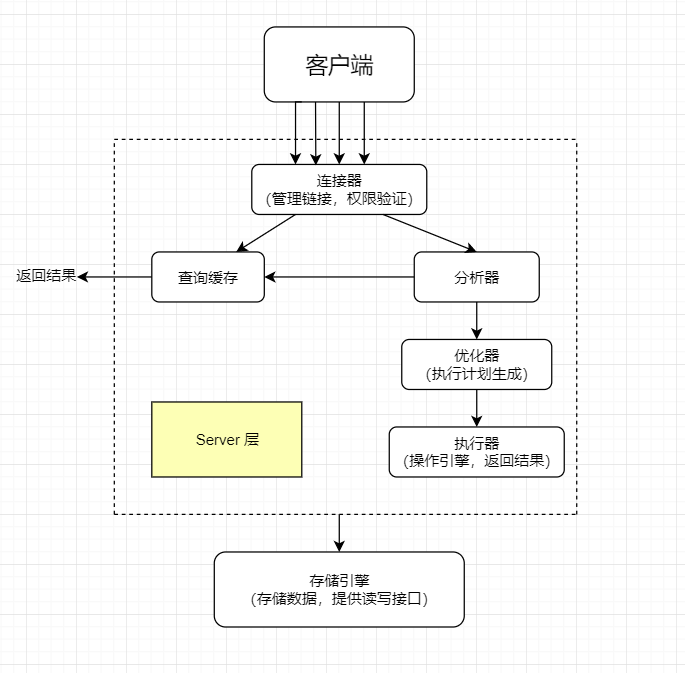
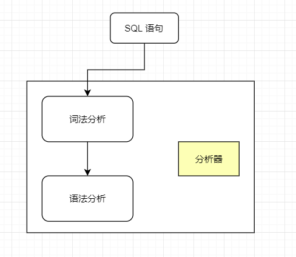
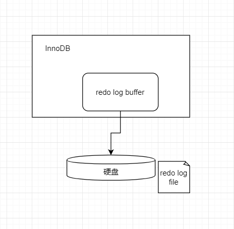

# MySQL 概念整理

整理 MySQL 的笔记，也许不仅仅包括概念。

**持续更新中...**

| 更新内容                                                     | 更新时间  |
| ------------------------------------------------------------ | --------- |
| 增加 [**三大范式**](https://hardews.cn/mysql-concept-study#%E4%B8%89%E5%A4%A7%E8%8C%83%E5%BC%8F) 相关内容 | 2023.9.4  |
| 增加 MySQL **[架构](https://hardews.cn/mysql-concept-study#mysql-%E6%9E%B6%E6%9E%84)** 相关内容 | 2023.9.6  |
| 增加 MySQL [**日志**](https://hardews.cn/mysql-concept-study#mysql-%E6%97%A5%E5%BF%97) 相关内容 | 2023.9.13 |
| 增加 MySQL [**事务**](https://hardews.cn/mysql-concept-study#%E4%BA%8B%E5%8A%A1) 相关内容 | 2023.9.23 |

<!--truncate-->

## 三大范式

### **1NF**

第一范式，即**表的列具有原子性**，不可再分。列的信息不能分解。

第一范式解决了**列重复**的问题。

### **2NF**

第二范式在第一范式的基础上新增了两个约束，

1. 每个表必须有一个主键
2. 非主键列必须完全依赖主键，而不能只依赖主键的一部分

通俗的讲，就是**一张表只能描述一件事情**。举例来说，有一张表 Student，表中字段是

| 学号 | 姓名 | 年龄 | 课程名称 | 成绩 | 学分 |
| ---- | ---- | ---- | -------- | ---- | ---- |

显而易见的是，

1. 学号 -> 姓名，年龄
2. 课程名称 -> 学分
3. 学号，课程名称 -> 成绩

很明显这不满足第二范式的要求。**这张表可以做很多事情**。如何拆分呢？可以根据上面列出的三种情况建三张表。

1. **学生表**，学号为主键，字段：学号，姓名，年龄
2. **课程表**，课程名称为主键（或者有课程编号，不重要），字段：课程名称，学分
3. **成绩表**，学号，课程名称作为联合主键，字段：学号，课程名称，成绩

设计满足第二范式有好有坏，**优点**是：

1. 整表的**数据冗余**会变少
2. **更新数据**更方便了，比如课程的学分变化后，不需要再一条条记录进行更新

### **3NF**

第三范式的要求是，在满足第二范式的情况下，消除传递依赖。**在任一主键都可以确定所有非主键字段值的情况下，不能存在某非主键字段 A 可以获取 某非主键字段 B**。也就是，**在一张表中，不能存在一种情况：B -> C，B 为非主键。**

举个例子，还是表 Student，有字段学号，姓名，班级，班主任。这显然是不符合第三范式的，因为班级可以推出班主任是谁。我们可以通过建立一张班主任表，表中字段班级，班主任。将 Student 表中的班主任字段去掉，这样这两张表就符合第三范式了。

### 总结

第一范式：列不可再分

第二范式：一张表只描述一件事情

第三范式：不能存在非主键可以推出其他非主键字段的情况。

## MySQL 架构

在了解 MySQL 前，有必要先了解它的架构。下面简单的介绍了一下 MySQL 的架构。

### 基本架构

如下图：

大致可以分为 Server 层和存储引擎层两部分。

如果进行细分，可以分成连接层、服务层、存储引擎层以及文件系统层。下面是它们主要的功能：

- **连接层**：主要是指数据库连接相关的工作，即处理所有客户端接入。
- **服务层**：包含 SQL 接口、解（分）析器、优化器以及查询缓存四块区域。
- **存储引擎层**：主要是指 MySQL 支持的各大存储引擎。
- **文件系统层**：涵盖了所有日志，以及数据、索引文件，位于磁盘中。

#### Server 层

Server 层包括连接器、查询缓存、分析器、优化器、执行器等。

##### 连接器

不多说，主要就是负责与客户端建立连接、获取权限、维持和管理连接的东西。（跟登录鉴权差不多）

##### 缓存

当我们进行查询时，会先查缓存，即之前有没有执行过这条语句。如果之前执行过，会以 k-v 的形式被缓存在内存中，key 是语句，val 是结果。如果有缓存就直接返回给客户端。

如果没有缓存，就会往下执行，然后在完成时加入缓存。

**But 8.0 这个功能已经被劈掉了**。

（感觉跟 MySQL + Redis 一样的流程）

##### 分析器

结合上图，分析器主要是两个功能：

1. 对于要执行的 SQL 语句，进行**词法**分析，也就是搞明白你输入的**这句话要干什么**。
2. 明白了干什么后，进行**语法**分析，就是要搞明白你**这句话有没得错误**。

##### 优化器

分析器分析完之后，MySQL 知道你要干什么了。但在开始前，还要进行一下优化。它需要做的主要工作是：

1. 表中有多个索引时，使用哪个索引
2. 表中多表关联时，表的顺序

详细内容待整理~~（抄）~~

##### 执行器

到这里，终于可以执行语句了。

主要步骤是：

1. 验证有无该表的操作权限
2. 调用引擎暴露的接口，去执行这个语句。
3. 返回满足条件的结果。

## MySQL 日志

上次讲到 MySQL 的基本架构时，细分出来有一个日志文件层，本文整理了 MySQL 中的几种日志及其作用。

### 二进制日志（binlog）

#### **介绍**

MySQL 的二进制日志 binlog 可以说是最重要的日志，它记录了所有的 DDL 和 DML 语句（除了数据查询语句 select、show 等）。以事件形式记录，并包含了语句执行的消耗时间。binlog 是**事务安全型**（）的，它的主要目的是复制和恢复，正如它的作用一样。

- 主从复制
- 数据恢复

#### **写 binlog 的时机**

对于支持事务的引擎（比如 InnoDB），必须要提交了事务才会记录 binlog。

binlog 什么时候刷新到磁盘与参数 sync_binlog 有关。

- 0，表示 MySQL 不控制 binlog 的刷新，由文件系统去控制它缓存的刷新。
- 1，默认且为最安全的，在系统故障时最多丢失一个事务的更新，但是会对性能有影响。
- 大于 1（n），即每 n 个提交的事务刷新一次。

<!--truncate-->

#### **binlog 日志格式**

1. STATMENT，基于 SQL 语句的复制（statement-based replication，SBR），每一条修改数据的 sql 语句都会记录到 binlog 中。

   优点：不需要记录每一行的变化，减少 binlog 日志量，节约 IO 从而提高性能。

   缺点：某些情况下主从数据不一致，比如执行 sysdate()、sleep() 等。

2. ROW，基于行的复制（row-based replication，RBR），不记录每条 sql 语句的上下文信息，仅需记录哪些数据被修改了。

   优点：不会出现某些特定情况下的存储过程，或 function、trigger 的调用和触发无法正常复制的问题。

   缺点：会产生大量的日志，尤其是 alter table 时。

3. MIXED，两种模式的混合复制（mixed-based replication，MBR），一般的复制按 STATEMENT 模式保存，对于前者无法复制的操作则用 ROW 模式保存 binlog。

#### **binlog 文件及其拓展**

binlog 日志包括两类文件：

- 二进制日志索引文件（后缀 .index），用于记录所有有效的二进制文件。
- 二进制日志文件（后缀 .00000*），记录数据库所有的 DDL 和 DML 语句事件。

当遇到以下三种情况时，MySQL 会重新生成一个新的日志文件，序号递增：

- MySQL 服务器停止或重启
- 使用 `flush logs` 命令
- 当 binlog 文件大小超过 `max_binlog_size` 变量的值时

#### **binlog 写入过程**

1. 事务执行过程中，将日志写到 binlog cache（binlog 的内存缓冲区）
2. 事务提交后，将 binlog cache 写入 binlog 文件中。（这里是每个事务线程都有一个自己的缓冲区，**一个事务的 binlog 不能被拆分**。）

系统给 binlog cache 分配了一块内存，每个线程一个，参数 binlog_cache_size 用于控制单个线程中 binlog cache 所占内存的大小。如果超过了这个大小，就会暂存到磁盘中。

### 事务日志（redo log & undo log）

#### 重做日志（redo log

##### 介绍

当进行了数据更新后，会将这个操作写入到 redo log 中（过程会在下面讲到）。

正如它的名字一样，redo log（重做日志），它是 InnoDB 存储引擎独有的，让 MySQL 有了崩溃恢复的能力。

每当 MySQL 实例挂了或者宕机后，重启 MySQL，都会使用 redo log 来恢复数据，从而保证数据库的持久性和一致性。

##### 写 redo log 的时机

redo log 主要分为两部分：

1. 内存中的日志缓存（`redo log buffer`）
2. 磁盘上的日志文件（`redo log file`）

mysql 执行 DML（数据操纵语言） 语句时，会先将记录写入 `redo log buffer`，后续根据参数在某个时间点将记录写到 `redo log file` 中。这种 **预写日志（先写日志，再写硬盘）** 的技术就是 `WAL(Write-Ahead Logging)`。

InnoDB 后台有个线程，一秒执行一次，执行时把 `redo log buffer` 中的内容写到文件系统缓存（`page cache`），然后调用 `fsync` 刷盘。

还有一种情况，当 `redo log buffer` 占用的空间即将达到 `innodb_log_buffer_size` 一半的时候，后台线程会主动刷盘。

和 binlog 差不多，redo log 什么时候更新到硬盘与参数 `innodb_flush_log_at_trx_commit` 有关：

- **设置为 0 的时候，表示每次事务提交时不进行刷盘操作。所以当 MySQL 挂了或宕机时，会丢失 1s 内的数据。**
- **设置为 1 的时候，表示每次事务提交时都将进行刷盘操作（默认值）。**
- **设置为 2 的时候，表示每次事务提交时都只把redo log buffer内容写入page cache，所以当 MySQL 宕机时，会丢失 1s 内的数据。**

#### 回滚日志（undo log

##### 介绍

undo log 是一种用于撤销回退的日志。它的主要作用有两个：

1. 提供回滚操作（事务的原子性）
2. 多版本控制的实现（MVCC）

##### undo log 的写入过程

undo log 用于事务没提交之前，会先记录存放到 undo log 文件里，当**事务回滚**时或者**数据库崩溃**时，可以利用 undo log 回退事务。

undo log 主要记录了数据的逻辑变化，比如一条 INSERT 语句，对应一条 DELETE 的 undo log，对于每个 UPDATE 语句，对应一条相反的 UPDATE 的 undo log，这样在发生错误时，就能回滚到事务之前的数据状态。

### 其他

- **错误日志**（mysql_error）。顾名思义，这是用来记录 MySQL 遇到各种错误时的日志文件。
- **一般查询日志**（general_log）。默认不启用，记录了 MySQL 服务器的操作。
- **慢查询日志**（slow_query_log）。默认不启用，记录了哪些 SQL 执行时间超出了预期（自定义）。

## 事务

### ACID

提到事务，ACID 是跑不开的：

- A，Atomicity，**原子性**。原子性是指事务是一个不可分割的工作单位，事务中的操作要么都发生，要么都不发生。
- C，Consistency，**一致性**。一致性是指事务前后数据的完整性必须一致。
- I，Isolation，**隔离性**。隔离性是指多个用户并发访问数据库时，数据库为每一个用户开启的事务，不能被其他事务的操作所干扰，多个并发事务之间要相互隔离。
- D，Durability，**持久性**。持久性是指一个事务一旦被提交，它对数据库中数据的更改就是永久性的，接下来数据库发生故障或者断电什么的，都不应该对其有任何影响。

### 为什么会有隔离级别？

当数据库上有多个事务同时执行时，可能会出现以下问题：

- **脏读（dirty read）：**脏读也可以叫 **读未提交**。举个例子，事务 A 操作数据库并更改了数据，与此同时，事务 B 立马读取了事务 A 更改后的数据。但是，事务 A 执行后面步骤时候出现了错误，回滚了。数据恢复了最初的模样。可是事务 B 毫不知情，还是将读取到修改后（被污染的）数据返回回去。这个就叫做**脏读**。
- **不可重复读（non-repeatable read）：** **前后多次读取，数据内容不一致**。这个会发生在读时变化。当一个事务 A 的流程很长，并且需要多次读取一个数据时，事务 B 在事务 A 两次读取中间修改了数据，导致事务 A 读取的数据前后不一致。举个例子，事务 A 第一次读取牛肉拌面的年龄为 20，此时，事务 B 将牛肉拌面的年龄修改为 21。在事务 A 第二次读取牛肉拌面的年龄是，读取到的是 21。这就是数据不重复了，发生了不可重复读。
- **幻读：** **前后多次读取，数据总量不一致**。事务 A 在统计某个条件范围的数据量，它第一次统计是 a 条。然后事务 B 增加并提交了一部分数据。事务 A 再次统计的时候变成了 b 条，莫名其妙的多了或少了几条，像出现了幻觉一样，就叫幻读。

### 隔离级别

为了解决上述问题，就有了 ”隔离级别“ 的出现：

- **读未提交（read uncommitted）**，一个事务还没提交时，它做的变更就能被其他事务看到。
- **读已提交（read committed）**，一个事务提交之后，才能被其他事务看到。
- **可重复读（repeatable read）**，一个事务执行过程中看到的数据，总是和这个事务启动时看到的数据是一致的。在可重复读的隔离级别下，未提交变更对其他事务也是不可见的。
- **串行化（serializable）**，顾名思义，就是对同一行记录，”读“ 和 ”写“ 都会加锁。当出现读写冲突的时候，后访问的事务必须等前一个事务执行完成后，才能继续执行。

MySQL 默认的隔离级别是 **可重复读**，而 Oracle 默认的隔离级别是 **读已提交**。

## Reference

[funnylog.gitee.io/mysql45/01讲基础架构：一条SQL查询语句是如何执行的.html](https://funnylog.gitee.io/mysql45/01讲基础架构：一条SQL查询语句是如何执行的.html)

[(一)全解MySQL之架构篇：自顶向下深入剖析MySQL整体架构！ - 掘金 (juejin.cn)](https://juejin.cn/post/7143614079532269598)

[MySQL Binlog 深度解析 - 掘金 (juejin.cn)](https://juejin.cn/post/7105727720549515300)

[必须了解的MySQL三大日志：binlog、redo log和undo log - 知乎 (zhihu.com)](https://zhuanlan.zhihu.com/p/190886874)

[MySQL回滚日志（undo log）总结_mysql undo log_每天都要进步一点点的博客-CSDN博客](https://blog.csdn.net/Weixiaohuai/article/details/117867353)

[【数据库】快速理解脏读、不可重复读、幻读_SunAlwaysOnline的博客-CSDN博客](https://blog.csdn.net/qq_33591903/article/details/81672260)

