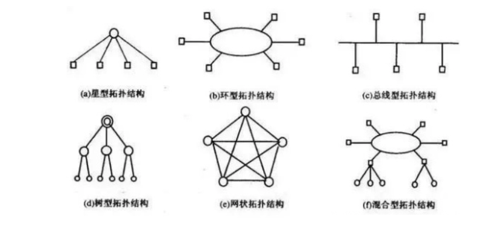
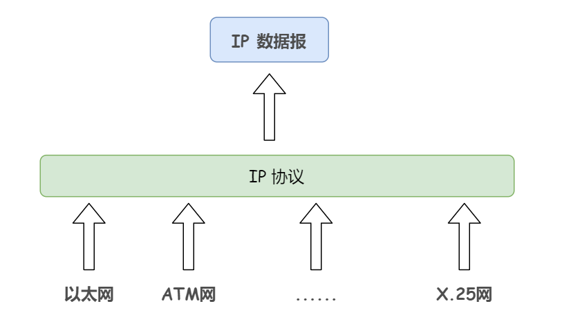

# 计算机网络

## TCP 如何创建链接？创建链接的流程？

**如何创建：**三握手。

**流程：**

1. 客户端主动打开链接（结束 CLOSED 阶段），此时服务器端被动打开链接（结束 CLOSED 阶段，进入 LISTEN 阶段）。

2. 第一步握手，客户端向服务器发送一段 TCP 报文，其中：

   - 标记位为 SYN，表示 ”请求建立新连接“；
   - 序号为 seq = X （X 一般为 1）

   随后客户端进入 SYN-SENT 阶段。

3. 服务器接收来自客户端的 TCP 报文之后，结束 LISTEN 阶段。并返回响应报文：

   - 标志位为 SYN 和 ack，表示 ”确认客户端的报文 seq 有效，服务器能够正常接收客户端发送的数据，并同意创建新连接”（即告诉客户端已接受到数据）
   - 序号为 seq = y
   - 确认号 ack = x + 1，表示收到客户端序号并将其加 1 作为确认号的值

   随后服务器端进入 SYN-RCVD 阶段。

4. 客户端接收到确认的数据报文后，明确客户端到服务器的数据传输时正常的，结束 SYN-SENT 阶段。并返回最后一段 TCP 报文：

   - 标志位 ack = y + 1，表示 “确认收到服务器端同意链接的确认号），将确认号设置为服务器端发送的序号 seq + 1。
   - 序号 seq = x + 1，表示收到确认号 ack，将序号设置为服务器端发送的确认号。

   随后客户端进入 ESTABLISHED 阶段。

5. 此时，服务器端收到了最后一段报文后，明确从服务器端到客户端的传输时正常的。结束 SYN-SENT 阶段，进入 ESTABLISHED 阶段。

在传输的 TCP 报文中，确认号与序号都是在彼此传输的确认号与序号的基础上进行计算的。这保证了 TCP 报文传输的连贯性。一旦报文丢失，则无法继续握手，以此确保三次握手的顺利进行。

## 为什么需要三握手？两次或者一次握手不行吗？

主要是为了放置服务器端开启一些无用连接增加服务器开销，以及防止已失效的连接请求报文段突然又重新传到服务器端，因此产生了错误。

**一次握手**：如果只有一次握手，服务器端并不能知道这是否是一个有效的链接，客户端也并不知道服务器端是否成功接收了链接，并不能确保发送的数据服务器端是否能收到。

**两次握手**：如果只有两次握手，当服务器端将响应报文返回给客户端时，客户端发送第三次确认报文。如果客户端此时出错了，并没有发送确认报文，等超时重传时才继续进行握手。这时候，服务器端是一直在等待的（因为两次握手已经完成了，它认为链接已经成功建立），这样就会导致不必要的开销。

所以，三次握手是有必要的，它是保证 TCP 可靠连接以及节省资源的一大支持。

## TCP 如何断开链接？断开连接的流程？

**如何断开**：四挥手。

**流程**：连接的释放（断开）必须是一方主动释放，另一方被动释放。以客户端发起释放连接为例：

1. 首先客户端主动想要释放连接，向服务器端发送一段报文：

   - 标志位 FIN，表示 “请求释放连接”
   - 序号 seq = U

   随后客户端进入 FIN-WAIT-1 阶段，即半关闭阶段。并且停止在客户端到服务器端方向发送的数据，但是客户端仍然可以接收服务器端传输的数据。

   注意，这里不发送正常连接时传输的数据（非确认报文），而不是全部数据，所以客户端仍然可以发送确认报文。

2. 服务器端接收到结束报文后，确认客户端想要释放连接，随后服务器端结束 ESTABLISHED 阶段，进入 CLOSE-WAIT 阶段（半关闭状态），并返回一段报文：

   - 标志位为 ack，表示 ”接收到客户端发送的释放连接的请求“
   - 序号 seq = V
   - 确认号为 ack = U + 1，表示是在收到客户端报文的基础上，将其序号 + 1 作为确认号的值。

   随后服务器端开始准备释放服务器端到客户端方向的连接。进入 CLOSE-WAIT 阶段。

   这两次挥手让服务器端知道了客户端想释放连接，也让客户端知道服务器端了解到了想要释放连接的请求。此时，客户端可以确认关闭客户端到服务器端的连接了，并进入 FIN-WAIT-2 阶段。

3. 当服务器端发出确认报文后，经过 CLOSED-WAIT 阶段，做好了释放服务器端到客户端方向连接的准备，再次向客户端发出报文：

   - 标志位 FIN, ACK，表示 ”已经准备好释放连接“。这里的 ACK 并不是确认收到服务器端报文的确认报文。
   - 序号 seq = W
   - ack = U + 1，表示在收到客户端报文的基础上，将其序号 + 1 作为确认号的值。

   随后服务器端结束 CLOSED-WAIT 阶段，进入 LAST-ACK 阶段。停止在服务器端到客户端方向发送数据，但是服务器端仍能接收从客户端传来的数据。

4. 客户端接收到服务器端发出的 TCP 报文，确认服务器端做好释放连接的准备，结束 FIN-WAIT-2 阶段，进入 TIME-WAIT 阶段，并向服务器端发送报文：

   - 标志位 ack ，表示 ”接收到服务器准备好释放连接的信号“
   - 序号为 seq = U + 1，表示在收到服务器报文的基础上，将其确认号 ack 作为本段报文序号的值
   - 确认号 ack = W + 1，表示收到服务器报文的基础上，将其序号作为本段报文确认号的值。

## 为什么客户端需要等待 2MSL？

等待 2MSL 是为了确认服务器端是否收到客户端的 ACK 确认报文，服务器端收到从客户端发出的 TCP 报文之后结束 LAST-ACK 阶段，进入 CLOSED 阶段。由此正确确认关闭服务器端到客户端的连接。

此时，如果服务器端没有收到确认报文，代表连接其实没有断开成功。会重新发送以保证连接能够正常断开。

## 为什么需要四挥手？

这是因为，服务器端不可能说断开就断开，它先要明确自己收到了客户端的请求（第二次挥手），然后它需要等待自己的数据传输完成后，准备好断开了，才能断开（第三次挥手）。

## TCP 是什么？

TCP 是 Transmission Control Protocol 的简称，中文名是传输控制协议。它是一种面向连接的，可靠的，基于字节流的传输层协议。

## UDP 是什么？

UDP 是 User Datagram Protocol 的简称，中文名是用户数据报协议。是 OSI 参考模型中的传输层协议，它是一种无连接的提供面向事务的**简单不可靠信息传送服务**。也就是说，它无法保证报文是否能够安全完整到达。

**拓展**（没问别答）

它的格式有两个部分

- 首部：它包括：
  - 源端口：2 字节，表示源端口号
  - 目的端口：2 字节，表示目的端口号
  - 长度：2 字节，校验 UDP 数据报的数据字段和包含 UDP 数据报首部的**伪首部**。其校验方法用 IP 分组首部校验和。伪首部是指在 TCP 分段或者 UDP 的数据报格式中，在数据报首部前加上源 IP 地址，目的 IP 地址，IP 地址分组和协议字段。它是一个临时结构，既不向上也不向下传递，仅仅只是为了保证可以校验套接字的正确性。
- 数据：顾名思义是传输的数据。

## OSI 参考（七层）模型？

开放系统互联（Open System Interconnection）。但随着时代的发展，逐渐被 TCP/IP 4 层模型淘汰。

OSI 分为 7 层，从上到下依次是：

- 应用层，网络服务与最终客户的一个接口（可以理解为人机交互画面）
- 表示层，数据的表示，安全，压缩（翻译成机器语言）
- 会话层，建立，管理，终止会话（传输到哪里，建立会话。或者哪里传输过来）
- 传输层，定义传输协议的协议端口号，以及控流和差错校验（定义怎么传输）
- 网络层，逻辑地址寻址，实现不同网络间的路径选择（找到需要传输到哪，这个哪的 ip 地址）
- 数据链路层，建立逻辑链接，进行硬件地址寻址，差错校验等功能（通过网卡，进行传输）
- 物理层，建立，维护，断开物理连接（变成信号传输啊啥的，就是真正的传输过去）

## TCP/IP 四层模型？

TCP/IP 四层模型就是将 OSI 七层模型中的上三层变为了应用层。

它相对于 OSI 七层模型来说，更简单，成本更低，效率也更高。

## QUIC 协议

QUIC: quick UDP internet connections，是一种基于 UDP 的传输层协议。

## 为什么协议分层？解决了什么问题？

计算机网络是一个非常复杂的系统，相互通信的两个计算机必须高度协调工作，但是这种协调是复杂的。

分层可以将庞大复杂的问题，转化为若干个较小的局部问题。这些局部较小的问题相对来说比较易于研究和处理，这是因为：

- 各层之间是独立的，不用关心其他层次的内容，每一层都可以有自己独立的实现方式。
- 灵活性好，任何一层发生变化都不影响上下层。
- 易于实现和维护，仅需维护独立的子系统。

## 计算机网络的分类方法？

主要是三种。

**地理位置**

地理位置又可以细分出三种：

- 局域网（LAN）：一般限定在较小的范围内，小于 10km 的范围，通常采用有线的方式连接起来。
- 城域网（MAN）：规模局限在一座城市，10~100km 的区域。
- 广域网（WAN）：网络跨越国界、州界甚至全球。广域网的代表是 internet 网

**传输介质**

- 有线网：采用同轴电缆和双绞线连接的计算机网络。经济实惠，安装便利，传输率和抗干扰能力一般，传输距离短，是常见的联网方式。
  - 其中光纤网属于有线网的一种，但由于特殊性而单独列出，光纤网采用光导纤维作传输介质。光纤传输距离长，传输率高，抗干扰性强，不会受到电子监听设备的监听。是高安全性网络的理想选择。

- 无线网：用电磁波作为载体来传输数据，无线网联网费用较高，还不太普及。但由于联网方式灵活方便，是一种很有前途的连网方式。

**拓扑结构**

计算机网络的拓扑结构是指网络中包括计算机在内的各种网络设备（如路由器、交换机）实现网络互连所展现出来的抽象连接方式。计算机网络拓扑所关心的是这种连接关系及其图标绘示，并不在意所连接计算机或设备的各种细节。

通过拓扑表可以清晰的了解到整个网络中个节点的线路连接情况以及整个网络的外貌结构。其中的节点主要是指网络中连接的各种有源设备。比如计算机、路由器、打印机、交换机等。这些节点通过微波、线路、光纤、电话等介质进行信息流的连接从而形成网络。

因此，计算机网络的拓扑结构就是节点和链路所组成的。计算机网络拓扑结构根据其连线和节点方式可分为以下几种类型：

- **星型拓扑结构**，主要是指一个中央节点周围连接着许多节点组成的网络结构，其中中央节点上必须安装一个集线器。所有的网络信息都是通过中央集线器（节点）进行通信的，周围的节点将信息传输给中央集线器，中央节点将所接收到的信息进行加工处理传输给其他节点。它的主要特点在于：

  - 建网简单
  - 结构易构
  - 便于管理等。

  主要缺点表现为中央节点负担繁重，不利于拓充线路的利用效率。

- **环形拓扑结构**，主要是各个节点之间进行首尾连接，一个节点连接着一个节点而形成一个环路。在环形拓扑结构中，网络信息的传输都是沿着一个方向进行的，是单向的。并且，在每一个节点中，都需要装设一个中继器，用于收发信息和对信息的扩大读取。它的主要特点是：

  - 建网简单
  - 结构易构
  - 便于管理

  以上我没抄错。。

  缺点在于节点过多时，传输效率不高，不利于拓充。

- **总线型拓扑结构**，总线型就是一根主干线连接多个节点而形成的网络结构。在总线型网络结构中，网络信息都是通过主干线传输到各个节点的。总线型的特点在于：

  - 简单灵活
  - 构建方便
  - 性能优良

  主要的缺点在于总干线对整个网络起决定作用，主干线的故障将引起整个网络瘫痪。

- **树型拓扑结构**，主要指各个主机进行分层连接，其中处在越高的位置，其节点的可靠性就越强。它其实是总线型网络结构的复杂化，如果总线型网络结构通过许多层集线器进行主机连接，则形成了树型网络结构。在互联网中，树形结构中的不同层次的计算机或者是节点，它们的地位是不一样的，树根部位（最高层）是主干网，相当于广域网的某节点，中间节点所表示的应该是大局域网或者城域网，叶节点所表示的就是最低的小局域网。树型结构中，所有节点中的两个节点之间都不会产生回路，所有的通路都能进行双向传播。其优点是：

  - 成本较低
  - 便于推广
  - 灵活方便

  比较适合那些分等级的主次较强的层次型网络

- **网状拓扑结构**，网状结构是最复杂的网络形式，它是指网络中任何一个节点都会连接着两条或以上线路，从而保持跟两个或更多的节点相连。网状型拓扑结构各个节点跟许多条线路连接着，其可靠性和稳定性都比较强，其比较适用于广域网。与此同时，构建此网络所花费的成本也是比较大的。

- **混合型拓扑结构**，是以上两种或两种以上结构拼接起来的结构。

下图是它们的图示：

## 两台计算机什么情况下可以通信？什么情况下不行？

从计网的角度分析，可以进行通信的情况取决于：

- 物理连接是否可靠，两台计算机之间需要通过以太网，无线网络，光纤等连接方式构建合理的拓扑结构，建立可靠的物理连接。只有当两台计算机之间有可靠的物理连接时，才能通信。
- 网络配置是否正确，两台计算机需要配置正确的网络参数，包括 IP 地址、子网掩码、默认网关等。它们应该属于同一个网络或通过路由器连接，以便彼此能够互相寻址和路由数据包。
- 协议支持是否相同，例如 TCP/IP 协议族。它们需要支持相同的网络协议，因为这些协议提供了在计算机之间传输数据的规范和约定。
- 网络防火墙是否允许，如果存在防火墙，需要确保防火墙允许两台计算机之间的通信。

根据上述所说，在以下情况，两台计算机可能无法进行通信：

- 物理连接故障
- 网络配置错误
- 支持协议不兼容
- 防火墙阻止通信

## 什么是 IP 协议？

IP 协议是整个 TCP/IP 协议族的核心，也是构成互联网的基础，位于 TCP/IP 模型的网络层。

IP 协议**用于屏蔽下层物理网络的差异，为上层提供统一的 IP 数据报**。

IP 协议提供无连接的、不可靠的、尽力的数据报投递服务：

- **无连接**的投递服务，不需要像 TCP 一样先建立连接
- **不可靠**的投递服务，它本身不保证 IP 数据报投递的结果。在传输的过程中，由于分组交换，一个 IP 数据报分成的分组可能会走不同的路径，甚至有可能其中的一部分数据报会在传输过程中丢失、延迟和乱序等。IP 协议不对内容作任何检测，也不将这些结果通知收发双方。
- **尽力**的投递服务，每个数据链路上会规定一个最大传输单元 MTU，如果 IP 数据报的长度超过 MTU，那么网络层就会把这些报文分割成一个一个的小组分组传送（分组交换），以适应具体的传输。

## 什么是 IP 地址？

IP地址（Internet Protocol Address）的全称叫作**互联网协议地址**，它的本义是**为互联网上的每一个网络和每一台主机配置一个唯一的逻辑地址，用来与物理地址作区分**。

IP 地址是 IP 协议中非常重要的内容，IP 数据包中包含收/发方的 IP 地址。

**因特网上的每台设备都规定了全世界唯一的地址**，叫做 IP 地址。（IP 地址是动态变化的，通过 DHCP 服务器自动分配，也可以自己根据实际情况更改），正是因为有了 IP 地址，才保证了用户在联网的计算机操作时，能高效且方便的从千千万万计算机中选出传输的对象。

和 MAC 地址一样，IP 地址并不是根据主机数来配置的，而是根据网卡（网络适配器）分配的。

## 什么是 MAC 地址？

MAC地址（Media Access Control Address）的全称叫做**媒体访问控制地址**，也称作局域网地址，以太网地址或者物理地址。

MAC地址用于在网络中唯一标示一个网卡，一台设备若有一或多个网卡，则每个网卡都需要并会有一个唯一的MAC地址。

## 有了 MAC 地址为什么还要 IP 地址？

随着网络中设备的增多，路由（寻找数据包从发送包到到接收方的路径）变得越来越困难。于是子网的诞生了（也就是把网络划分成多个子网）。这样在路由的时候，路由器可以把其他子网看着一个整体来进行计算。那么在传输数据包时，只需要让数据包到达子网，剩下的交给子网内部处理，大大减少了路由器的计算量。

根据上面说的，如果只用 MAC 地址的话，路由器需要记住每个 MAC 地址所在的子网是哪一个（不然每次传输都要满世界找）。这样每个路由器需要的内存是很大的。所以我们需要 IP 地址，它是和地域相关的。对于同一个子网上的设备，分配的 IP 地址前缀是一样的。**而 MAC 地址就是门牌号。路由器发送时只需要记住你的邮政编码，给你送到相应的子网，然后子网根据你的 MAC 地址（也就是门牌号），将数据包派送到你那里。**

这就是为什么有了 MAC 地址还要 IP 地址。同时也不能只保留单独一个。

## 什么是 IPv4？什么是 IPv6？

IPv4 全程为 Internet Protocol version 4，为互联网上的每一个网络和每一台主机分配一个逻辑地址。对于 IPv4 来说，IP 地址时一个 32 位的二进制数，这些地址中分有 A,B,C,D,E 五类，比较常用的只有 B 类和 C 类。（在 11 年的时候 IANA 中的 IPv4 地址池就已经全部耗尽了）

而 IPv6，是用于替代 IPv4 的下一代协议，地址长度时 128 位，长度是 IPv4 的 4 倍。可以提供的地址目前来看根本用不完。

## IPv4 地址不够如何解决？

最根本的解决办法：使用 128 位的 IPv6 地址。

其他的办法：

CIDR（无分类 IP 地址），放弃 IP 地址分类，采用任意长度分割 IP 地址的网络号和主机号。CIDR 的表现形式位 `a.b.c.d/x`，其中 `/x` 表示前 x 位为网络号，可以根据需要变化长度。

NAT（网络地址转换），在本地网络中使用私有地址，在连接互联网时使用全局 IP 地址。就是很多个私有 IP 公用一个全局 IP（公网 IP）。

## IPv4 和 IPv6 的区别

主要区别：

- 拓展编址功能和自动配置机制。
- 报头格式的简化。IPv6 的报头固定为 40 字节，刚好容下 8 字节的报头和两个 16 字节的 IP 地址（源地址，目的地址）。它去掉了 IPv4 报头中的一些字段，或者将其变成可选项，使数据包可以在低消耗处理下更快的进行操作。
- 改进的拓展和选项支持。对于 IPv4，选项集成于基本的 IPv4 报头中。而对于 IPv6，这些选项被作为拓展报头处理。
- 身份验证和私密性的拓展。IPv6 直接集成了身份验证的支持。
- 流标签。属于同一传输流且需要特别处理或需要服务质量的数据包，可以由发送者进行标记。

## 什么是 ARP？

ARP(Address Resolution Protocol)，地址解析协议，实现由 IP 地址到 MAC 地址的转换。

## ARP 实现原理？

主要通过 ARP 请求和 ARP 响应两种类型的包确定 MAC 地址。每个主机都有一个 ARP 高速缓存，里面有本局域网上各主机和路由器的 IP 地址到 MAC 地址的映射表。并且高速缓存是有期限的。

