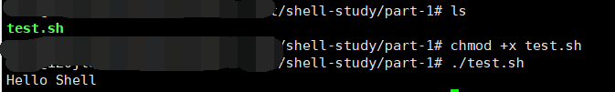

# 前言

## 什么是 Shell

Shell 是一个用 C 语言编写的程序，是用户使用 Linux 的桥梁。它既是一种命令语言，又是一种程序设计语言。

Shell 是指一种应用程序，这个应用程序提供了一个界面，用户通过这个界面访问操作系统内核的服务。


## Shell 脚本

即 Shell Script，是一种为 Shell 编写的脚本程序。它和上面说的不是一个概念。

常见的 Shell 种类有：

- Bourne Shell (/url/bin/sh or /bin/sh)
- Bourne Again Shell (/bin/sh)
- C Shell
- K Shell


我学的是第二种，也就是 bash，Bourne Again Shell。


## 第一个 Shell 脚本

```shell
#!/bin/bash
echo "Hello World!"
```

第一行的 #! 是一个约定的标记，告诉系统这个脚本需要什么解释器执行。

echo 则相当于各种语言的输出语句。

### 运行 Shell 脚本

- 可执行程序

  将代码保存后，cd 至相应目录。然后执行。

  

  这里一定要写成 ./test.sh 是因为 Linux 系统会直接去 PATH 里找有没有叫 test.sh 的。而 PATH 里一般只有 /bin, /sbin, /usr/bin 等。当前目录通常不在 PATH 里，故 test.sh 找不到命令。

- 作为解释器参数

  如 `/bin/sh test.sh`。这种方式则不需要再第一行指定解释器信息，写了也没有用。

